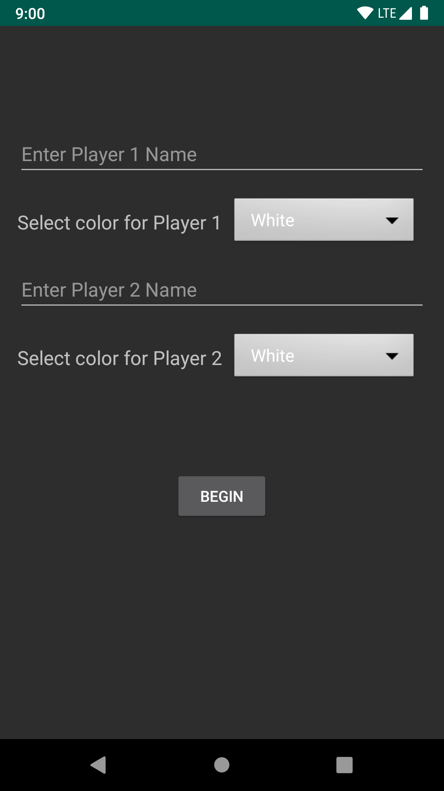
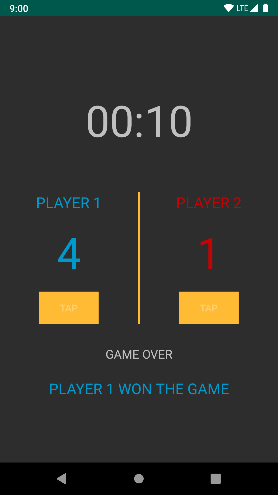

# ScoreKeeper
An android-based game app that last for 10 seconds and displays the total number of taps you have against an opponent.

## Getting started
Import the project in Android Studio and compile it to your **android device**.

### Prerequisites
  * Java SE Development Kit
  * Android Studio
  * Android device

## Screenshots
&nbsp; &nbsp; &nbsp; &nbsp; 

## Authors
  * Sijan Rijal - [sijanr](https://github.com/sijanr)
  
## License
This repository is licensed under [LICENSE](./LICENSE)
